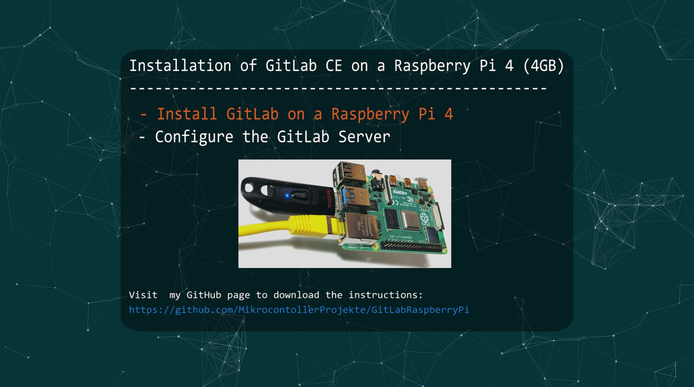
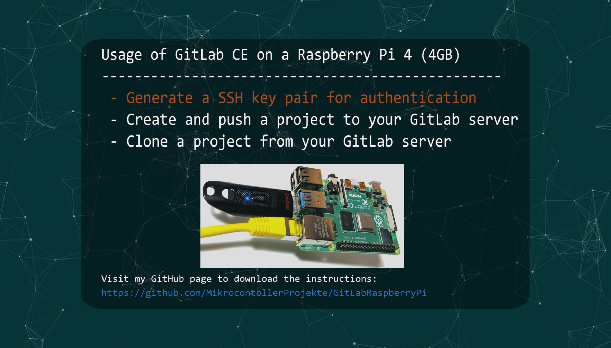
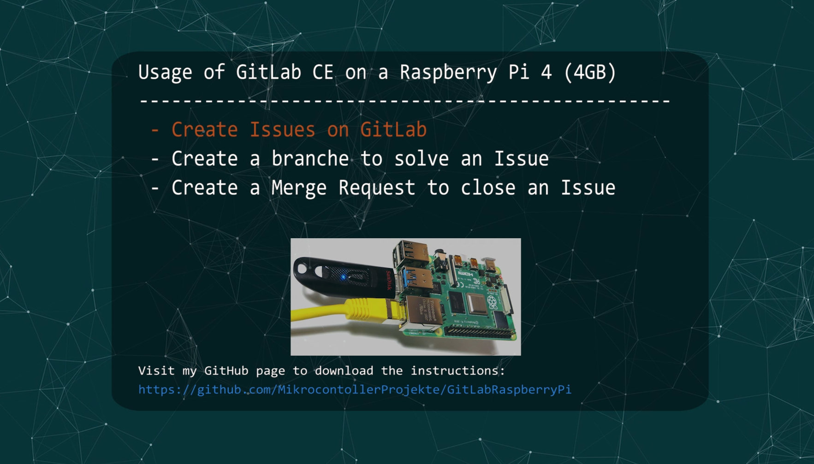
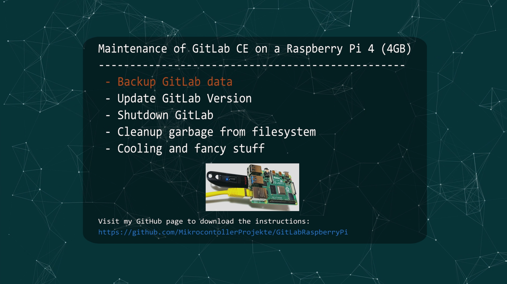

# Part 1: Installation of GitLab CE on a Raspberry Pi 4 (4GB)
- Install GitLab on a Raspberry Pi 4
- Configure the GitLab server
   
Download Instructions here: https://github.com/MikrocontollerProjekte/GitLabRaspberryPi/blob/master/GitLabRaspberryPi.sh
 
 
<b>Full YouTube video tutorial:</b>
 
 

")

 
 
 

 

 
 
 

# Part 2: Usage of GitLab CE on a Raspberry Pi 4 (4GB)
- Generate a SSH key pair for authentication
- Create and push a project to your GitLab server
- Clone a project from your GitLab server
   
Download Instructions here: https://github.com/MikrocontollerProjekte/GitLabRaspberryPi/blob/master/GitLabRaspberryPi.sh
 
 
<b>Full YouTube video tutorial:</b>
 
 

")

 
 
 

 

 
 
 

# Part 3: Usage of GitLab CE on a Raspberry Pi 4 (4GB)
- Create Issues on GitLab
- Create a branch to solve an Issue
- Create a Merge Request to close an Issue
   
Download Instructions here: https://github.com/MikrocontollerProjekte/GitLabRaspberryPi/blob/master/GitLabRaspberryPi.sh
 
 
<b>Full YouTube video tutorial:</b>
 
 

")

 
 
 

 

 
 
 

# Part 4: Maintenance of GitLab CE on a Raspberry Pi 4 (4GB)
- Backup GitLab data
- Update GitLab Version
- Shutdown GitLab
- Cleanup garbage from filesystem
- Cooling and fancy stuff (OLED)

   
Download Instructions here: https://github.com/MikrocontollerProjekte/GitLabRaspberryPi/blob/master/GitLabRaspberryPi.sh
 
 
<b>Full YouTube video tutorial:</b>
 
 

")

 
 
 

 

For more videos, visit: https://www.youtube.com/c/MikrocontrollerProjekte.

